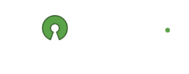
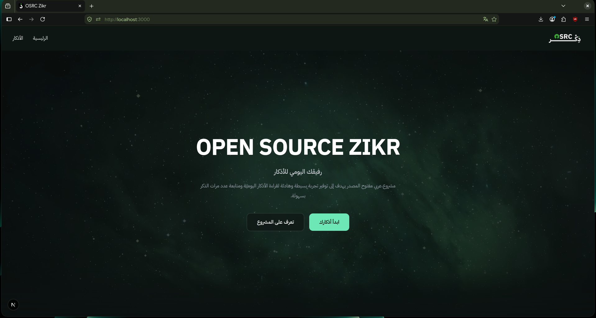
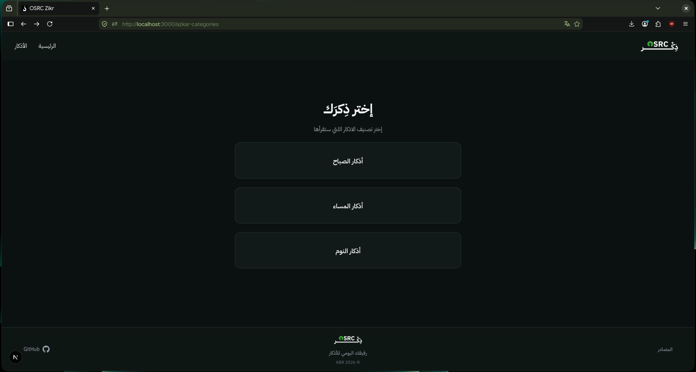
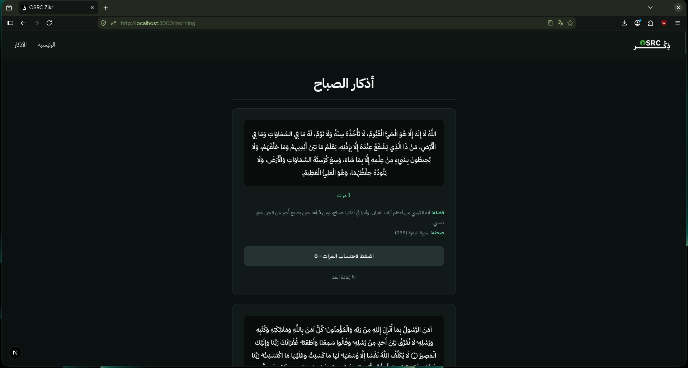

<div align="center">



# OSRC Zikr

### An open-source Arabic platform for daily Islamic Azkar.

A simple, modern and privacy-focused web experience designed to make daily Azkar easier to read, follow and keep track of.

<br>

<a href="https://osrcz.vercel.app/">
  
</a>
<a href="./LICENSE">
  
</a>

<br><br>


<br><br>

[Live Website](https://osrcz.vercel.app/) · [Self-Hosting](#self-hosting) · [Sources](#sources) · [License](#license)

</div>

---

## About

**OSRC Zikr** is an open-source Arabic platform built around one simple idea:

> Make daily Azkar accessible through a modern, calm and distraction-free experience.

The project combines traditional Islamic content with a modern web interface, providing users with categorized Azkar, repetition tracking, daily statistics and references in one place.

OSRC Zikr is designed primarily for Arabic-speaking users, with an **Arabic-first RTL interface** throughout the application.

### Why OSRC Zikr?

Many existing Azkar experiences are either heavily focused on text, difficult to navigate or built around outdated interfaces.

OSRC Zikr aims to provide something different:

* A clean and modern Arabic interface
* Simple navigation between Azkar categories
* Interactive repetition tracking
* Separate full and short Azkar collections
* Daily progress statistics
* Seven-day activity overview
* Per-category progress tracking
* References for religious content
* Responsive design for different screen sizes
* No unnecessary accounts or configuration
* Open-source and easy to self-host

The project intentionally keeps the experience simple instead of adding unnecessary complexity.

---

## Preview

<div align="center">



<br><br>



<br><br>



</div>

---

## Features

<table>
<tr>

<td width="50%" valign="top">

### Azkar Categories

Organized categories make it easier to find the Azkar you need throughout the day.

</td>

<td width="50%" valign="top">

### Repetition Tracking

Interactive counters help you keep track of how many times each Zikr has been completed.

</td>

</tr>

<tr>

<td width="50%" valign="top">

### Full & Short Collections

Morning and evening Azkar are available in separate full and short collections, allowing users to choose the experience that fits them.

</td>

<td width="50%" valign="top">

### Daily Statistics

Track completed Azkar for the current day with separate progress for morning, evening and sleep categories, including full and short collections.

</td>

</tr>

<tr>

<td width="50%" valign="top">

### Seven-Day Overview

Review activity across the last seven days and select individual days to inspect their detailed progress.

</td>

<td width="50%" valign="top">

### Local Progress

Zikr completion data is stored locally in the browser, so the core progress system does not require an account or database.

</td>

</tr>

<tr>

<td width="50%" valign="top">

### References

Each Zikr can include its source, reference and relevant information about its authenticity.

</td>

<td width="50%" valign="top">

### Arabic First

The entire interface is designed around Arabic content and RTL navigation.

</td>

</tr>

<tr>

<td width="50%" valign="top">

### Responsive

The interface adapts to desktop, tablet and mobile screens.

</td>

<td width="50%" valign="top">

### Lightweight

The core experience does not require a database or external Azkar API.

</td>

</tr>

<tr>

<td width="50%" valign="top">

### Website Analytics

The production website uses Vercel Analytics to understand website usage and improve the experience.

</td>

<td width="50%" valign="top">

### Open Source

The project is publicly available under the MIT License and can be studied, modified and self-hosted.

</td>

</tr>
</table>

---

## Technology

OSRC Zikr is built using a modern and lightweight web stack.

<div align="center">

### Core

<br>

<table>
<tr>

<td align="center" width="140">


<br>

<b>Next.js</b>

<br>

<sub>Application Framework</sub>

</td>

<td align="center" width="140">


<br>

<b>React</b>

<br>

<sub>UI Library</sub>

</td>

<td align="center" width="140">


<br>

<b>TypeScript</b>

<br>

<sub>Type Safety</sub>

</td>

</tr>
</table>

### Styling & UI

<br>

<table>
<tr>

<td align="center" width="140">


<br>

<b>Tailwind CSS</b>

<br>

<sub>Styling</sub>

</td>

<td align="center" width="140">


<br>

<b>React Icons</b>

<br>

<sub>UI Icons</sub>

</td>

</tr>
</table>

### Deployment & Analytics

<br>

<table>
<tr>

<td align="center" width="140">


<br>

<b>Vercel</b>

<br>

<sub>Deployment</sub>

</td>

<td align="center" width="140">


<br>

<b>Vercel Analytics</b>

<br>

<sub>Website Analytics</sub>

</td>

</tr>
</table>

</div>

---

## Architecture

The project follows a relatively simple Next.js structure.

```text
osrc-zikr/
│
├── public/
│   ├── logo2.png
│   └── screenshots/
│       ├── image.png
│       ├── image2.png
│       └── image3.png
│
├── src/
│   ├── app/
│   │   ├── page.tsx
│   │   ├── azkar/
│   │   ├── azkar-categories/
│   │   └── sources/
│   │
│   ├── components/
│   │   ├── Header.tsx
│   │   ├── Footer.tsx
│   │   ├── ZikrItem.tsx
│   │   ├── ZikrStats.tsx
│   │   └── ScrollToTop.tsx
│   │
│   └── lib/
│       ├── zikrStats.ts
│       └── zikrStatsCalculator.ts
│
├── LICENSE
├── package.json
├── README.md
└── tsconfig.json
```

---

## Live Website

The production version of OSRC Zikr is deployed on **Vercel**.

You can use the hosted version directly without installing anything.

<div align="center">

<a href="https://osrcz.vercel.app/">
  
</a>

</div>

---

## Self-Hosting

OSRC Zikr can be run locally or deployed to your own server.

### Requirements

* Node.js
* npm
* Git

Check your installed versions:

```bash
node --version
npm --version
git --version
```

### Installation

Clone the repository:

```bash
git clone https://github.com/suss200/osrc-zikr.git
cd osrc-zikr
```

Install dependencies:

```bash
npm install
```

Start the development server:

```bash
npm run dev
```

The application will be available at:

```text
http://localhost:3000
```

### Production

Create a production build:

```bash
npm run build
```

Start the production server:

```bash
npm start
```

The current version does not require environment variables or a database for the core Azkar experience.

---

## Deployment

OSRC Zikr is currently deployed using **Vercel**, but the application can also run on your own infrastructure.

A basic self-hosted production setup can look like:

```text
                    Internet
                       │
                       ▼
                ┌─────────────┐
                │    Nginx    │
                │ Reverse Proxy│
                └──────┬──────┘
                       │
                       ▼
                ┌─────────────┐
                │   Next.js   │
                │   Server    │
                └─────────────┘
```

Any hosting environment capable of running a Next.js production application can be used.

---

## Data & Storage

The current version intentionally keeps the data layer simple.

The Azkar content is maintained as application data rather than being fetched from an external Azkar API for every request.

A typical Zikr entry contains information such as:

```ts
{
    id: "morning-full-01",
    text: "...",
    count: 3,
    virtue: "...",
    reference: "..."
}
```

Because of this, the core application currently does not require a database.

### Current Storage Model

| Data             | Storage                      |
| ---------------- | ---------------------------- |
| Azkar            | Application source           |
| References       | Application source           |
| UI configuration | Application source           |
| User accounts    | Not required                 |
| User progress    | Local/client-side experience |
| Daily statistics | Local/client-side experience |
| Database         | Not required                 |

### Progress & Statistics

Each Zikr has a stable `id`, allowing completion to be tracked independently from the Zikr text.

The statistics system keeps daily completion data separated by category:

```text
morning-full
morning-short
night-full
night-short
sleep
```

Completion records are grouped by date and stored in the browser using `localStorage`.

This allows the application to calculate:

* Today's completed Azkar
* Remaining Azkar for the day
* Separate progress for full and short collections
* Activity across previous days
* The last seven days of activity
* Current activity streak
* Longest activity streak

The statistics interface keeps full and short morning/evening collections separate instead of combining their progress.

Future versions may introduce persistent user features such as accounts, synchronization, favorites or personalized settings. Those features may require a dedicated database.

---

## Sources

Religious content is an important part of OSRC Zikr.

The project includes references alongside the available Azkar so users can trace the information back to its source.

### Dorar.net

Used primarily for Hadith search, references and verification.

<a href="https://dorar.net/">
  
</a>

### Quran.com

Used for Quranic references.

<a href="https://quran.com/">
  
</a>

References are provided to make the underlying material easier to review.

---

## Religious Content Disclaimer

OSRC Zikr is a software project and is **not a religious authority**.

The project does not issue Fatwas or religious rulings and should not be considered a replacement for qualified scholars or trusted Islamic institutions.

References are provided so users can review the underlying material themselves.

If you notice an incorrect wording, reference, attribution or repetition count, the original source should be checked before relying on the information.

---

## Privacy

Privacy is one of the project's core design goals.

The current core experience does not require users to:

* Create an account
* Provide personal information
* Connect an external Azkar API
* Use a database

Zikr progress and daily statistics are stored locally in the user's browser and are not required to be sent to a backend for the core experience.

The production website uses Vercel Analytics for website usage analytics.

When self-hosting OSRC Zikr, the server administrator is responsible for the infrastructure, server logs and any additional services added to the deployment.

---

## Project Goals

OSRC Zikr is more than a UI project.

The long-term goal is to build a reliable, accessible and open platform for daily Azkar while keeping the software itself simple and transparent.

The project focuses on:

**Accessibility**

Making daily Azkar easy to access from any modern device.

**Simplicity**

Keeping the interface focused on what actually matters.

**Transparency**

Keeping the source code publicly available so the implementation can be inspected.

**Accuracy**

Providing references alongside religious content whenever possible.

**Privacy**

Avoiding unnecessary collection of user information.

**Open Source**

Building the project in the open and allowing others to study and use the code.

---

## License

OSRC Zikr is released under the **MIT License**.

The MIT License allows the software to be used, modified and distributed under its terms while preserving the original copyright and license notice.

See the [`LICENSE`](./LICENSE) file for the complete license text.

---

## Disclaimer

OSRC Zikr is provided as an open-source software project.

The information presented by the application is provided for informational and devotional purposes and should be reviewed against the referenced sources.

The maintainers are not responsible for religious rulings or interpretations derived from the software.

---

<div align="center">


<br>

### OSRC Zikr

**Open Source · Arabic · Simple**

Built with Next.js for the Arabic-speaking community.

<br>

<a href="https://osrcz.vercel.app/">Website</a>
  ·   <a href="https://github.com/suss200/osrc-zikr">GitHub</a>
  ·   <a href="#osrc-zikr">Back to top</a>

</div>
```

ده كده جاهز تنسخه كله وتحطه مكان `README.md`.
